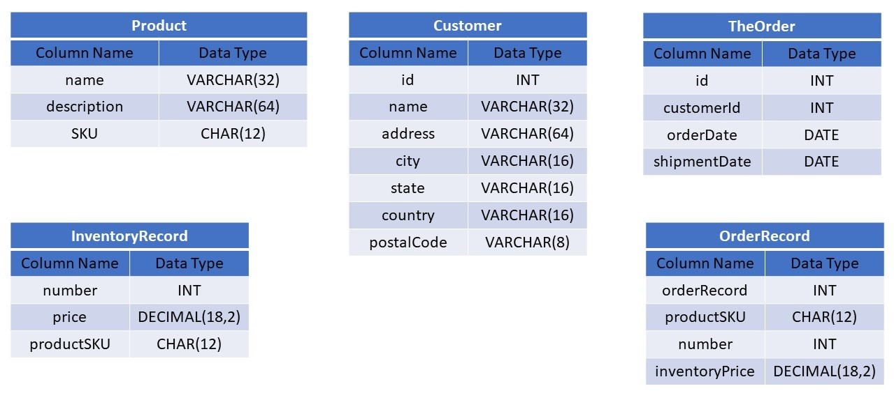
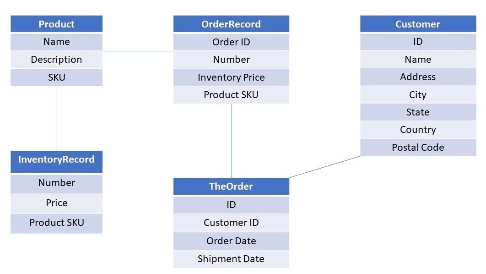

# OrderManager: A Database for Managing Products and Orders

## Table of Contents
* [Overview](#overview)
* [Team](#team)
* [Technology](#technology)
* [Schema](#schema)
* [Deliverables](#deliverables)
* [Build](#build)
* [Tests](#tests)
* [Design](#design)


## Overview
OrderManager is an e-commerce program that enables a business to manage information about products that can be sold to customers, to track current inventories of products, and to process orders for products from customers. 

The RDBMS maintains information about products that can be ordered by costumers, tracks inventory levels of each product, and handles orders for product by customers. 

Detailed project [specification](./ProjectDescription.pdf)

## Team 
* asarkytbayev - Azamat Sarkytbayev &lt;sarkytbayev.a@husky.neu.edu&gt;
[github profile](https://github.com/asarkytbayev)
* yitonghu - Yitong Hu &lt;hu.yit@husky.neu.edu&gt;
[github profile](https://github.com/lightlyh)

## Technology
* JavaDB
* SQL

## Schema
### Tables



### UML image


## Deliverables

### Modules

- **OrderManager.java** - This program creates a manager database for the ER data model for OrderManager. There are entity tables for Product, Customer, TheOrder, and InventoryRecord, and relationship table for OrderRecord relation in the ER model.

- **TestOrderManager.java** - This program tests the version of the manager database tables for OrderManager that uses relation table for OrderRecord relation. The sample data is stored in eight tab-separated data files. 

- **Helper.java** - This file contains stored functions for parsing, validating, and converting OrderManager types to strings.

- **Util.java** - This file contains functions for printing Product, InventoryRecord, TheOrder, and OrderRecord in the database. 
  
### Data Sets  
Product file is organized into the following columns: product name, description, SKU, quantity in stock, and price.  
- **products.txt** - This file contains products data for testing purpose.  
  
All customer files are organized into the following columns: product SKU, price, quantity customer wants to buy, customer name, address, state, country and postal code, order date and shipment date.  
- **customer1.txt** - This file contains data of customer Azamat Sarkytbayev's first order with a single kind of item.

- **customer2.txt** - This file contains data of customer Philip Gust's order with two kinds of items.

- **customer3.txt** - This file contains data of customer Yitong Hu's order with three kinds of items.

- **customer4.txt** - This file contains data of customer Azamat Sarkytbayev's second order with a single kind of item, whose number happens to surpass the corresponding inventory.

- **customer5.txt** - This file contains data of customer P.K. Agarwal's order with a single kind of item, where the shipment date is earlier than order date.

- **customer6.txt** - This file is identical to **customer1.txt**.

- **customer7.txt** - This file contains data of customer Emily Smith's order with a single kind of item.

### Doc

- **ProjectDescription.pdf** - This file is the project specification.


## Build  

### Setup

In order to build OrderManager, you need to have the Java Development Kit (JDK) and the Apache Derby software. See [installation tutorial](https://db.apache.org/derby/papers/DerbyTut/install_software.html) for more info.

Clone or download a copy of OrderManager to your chosen location, open it in local development environment.

After installation, embed Apache Derby in this Java project. In your Java Build Path, add derby.jar and derbyclient.jar files as external libraries from the Derby directory.

### Run

Run OrderManager.java as Java Application.

### Sample Output

```bash
Connected to and created database orderManager

# drop the database triggers, tables, and stored functions, recreate them below
Dropped trigger OrderRecordInsert
Dropped table OrderRecord
Dropped table TheOrder
Dropped table Customer
Dropped table InventoryRecord
Dropped table Product
Dropped stored function isSKU()

Created stored function isSKU()
Created entity table Product
Created entity table InventoryRecord
Created entity table Customer
Created relation table TheOrder
Created relation table OrderRecord
Created trigger for inserting OrderRecord
```


## Tests

### Stored function

The database has one stored function for the purpose of validating product sku type. Before the code that adds values to the database, create tests that invoke the function using a values query with representative value from data file, as well as with invalid value.

### CHECK constraint evaluation

The database has three tables containing CHECK constraint. Product table has a CHECK with SKU column using the isSKU stored function, InventoryRecord table has CHECK with both price column and number column, and TheOrder table has CHECK with both orderDate column and shipmentDate column.

If the value being added to an attribute of a tuple violates the CHECK constraint, the CHECK constraint evaluates to false. The corresponding database update is aborted, and a SQLException is thrown.

```bash
try {
   ...
} catch (SQLException ex) {
   ...
   # print error message
   if (SQLState.LANG_CHECK_CONSTRAINT_VIOLATED.equals(ex.getSQLState())) { 
      System.err.printf("SKU '%s': %s\n", sku, ex.getMessage());
   }
   continue;
}
```

### Populating Product and InventoryRecord tables

* Use one while loop to read all the lines in products.txt
* Insert data table by table
* Commit insertions
* Print Product and InventoryRecord tables

  Sample Output:
  ```bash
  Products:
  SKU             	 Name          Description     
  AB-123456-0N    	 Keyboard      Typewriter-style device
  DC-835790-AB    	 Monitor       Output display device
  EE-345987-30    	 Mouse         Input device moves cursor
  OU-436713-X2    	 Cable         Wires covered in a plastic
  YW-968406-5T    	 Processor     IC drives the computer

  InventoryRecord:
  SKU             	 Number        Price           
  AB-123456-0N    	 100	       15.56
  DC-835790-AB    	 100	       30.00
  EE-345987-30    	 100	       3.24
  OU-436713-X2    	 100	       5.78
  YW-968406-5T    	 100	       399.99
  ```
### Populating Customer, TheOrder and OrderRecord tables

* Use one for loop to iterate through all seven customer data files
* Before insertion into the tables, query TheOrder and Customer tables respectively to get the last inserted value of identity column (order id for TheOrder table, customer id for Customer table). For example, for TheOrder table, use the SQL syntax "SELECT IDENTITY_VAL_LOCAL() FROM TheOrder":
  ```bash
  int orderId = 0;
  String findId = "SELECT IDENTITY_VAL_LOCAL() FROM TheOrder";
  rs = stmt.executeQuery(findId);
  if (rs.next()) {
     # if TheOrder table is not empty, retrieve the last orderId
     Integer result = rs.getInt(1);
     # if the order transaction has been rolled back, just use it as the new order id
     if (isRolledBack) { 
	    orderId = result;
     } else { 
        # if no rollback happens, increment it by 1 to get the new order id
	    orderId = result + 1;
     }
     System.out.println("new OrderId: " + orderId);
  } else {
     # if TheOrder table is empty, set orderId to 1
     orderId = 1;
     System.out.println("No values in the table TheOrder. new OrderId: " + orderId);
  }
  rs.close();
  ```
* Set the identity column value in Customer and TheOrder tables. For example, for TheOrder table, use the SQL syntax "ALTER TABLE TheOrder ALTER COLUMN id RESTART WITH ":
  ```bash
  try {
     String restart = "ALTER TABLE TheOrder ALTER COLUMN id RESTART WITH " + orderId;
     stmt.executeUpdate(restart);
     System.out.println("Reset TheOrder identity column");
  } catch (SQLException e) {
     System.err.println(e.getMessage());
  }
  ```
  The necessity of this operation lies in identity column attribute. See [Gensym strategy](#gensym-strategy) for more info. 
  
* Create a save point before adding values in each customer data file to the database
* Inside the for loop, use one while loop to read all the lines in each customer data file
* Insert data table by table

  Query tables first to avoid duplicate insertion and retrieve corresponding identity column values. For example, for TheOrder table, use the SQL syntax "ALTER TABLE TheOrder ALTER COLUMN id RESTART WITH ":
  ```bash
  try {
     # use SQL query SELECT COUNT(*) FROM TheOrder WHERE id = ? AND customerId = ?
	 queryRow_TheOrder.setInt(1, orderId);
	 queryRow_TheOrder.setInt(2, customerId);
	 queryRow_TheOrder.execute();
	 rs = queryRow_TheOrder.getResultSet();
	 if (rs.next()) {
		Integer result = rs.getInt(1);
		if (result == 1) {
		    # no need to insert the order once again
		} else {
		    # add a single TheOrder entry for a given customer's order
		    insertRow_TheOrder.setInt(1, customerId);
		    insertRow_TheOrder.setDate(2, orderDate);
		    insertRow_TheOrder.setDate(3, shipmentDate);
		    insertRow_TheOrder.execute();
		}
	 }
	 rs.close();
  } catch (SQLException e) {
	 isRolledBack = true;
	 System.err.println(e.getMessage());
  }
  ```
  
  There are two scenarios where rollback happens. When populating TheOrder table, if somehow shipment date is earlier than order date, the database will throw an exception, the error message indicates:
  ```bash
  The check constraint 'CHK_DATES' was violated while performing an INSERT or UPDATE on table '"USER1"."THEORDER"'.
  INSERT on table 'ORDERRECORD' caused a violation of foreign key constraint 'FK_ORDER_ID' for key (4).  The statement has been rolled back.
  ```
  Note the rollback does not affect Customer table.  
  
  Likewise, during the process of inserting into OrderRecord table, if the number of units of a product that customer wants to buy surpasses the current inventory, the CHECK constraint on InventoryRecord table is violated, causing all the changes since starting the order transaction to be rolled back to the saved point. Execution continues with the next customer's order. The error message indicates:
  ```bash
  Insufficient stock! Customer Azamat Sarkytbayev attempted to buy more items than in stock. Rolling back
  ```
* Commit insertions
* Print InventoryRecord, Customer, TheOrder and OrderRecord tables

  Sample Output:
  
  ```bash
  Updated Inventory Record:

  InventoryRecord:
  SKU             	Number          	Price           
  AB-123456-0N    	75              	15.56           
  DC-835790-AB    	90              	30.00           
  EE-345987-30    	85              	3.24            
  OU-436713-X2    	100             	5.78            
  YW-968406-5T    	74              	399.99          

  Customers:
  ID  	Name            	Address                         	City        	State	Country 	Postal Code
  1   	Azamat Sarkytbayev	6024 Silver Creek Valley Rd     	San Jose    	CA  	USA     	95116   
  2   	Philip Gust     	360 Huntington Ave              	Boston      	MA  	USA     	02115   
  3   	Yitong Hu       	101 N. Tryon Street             	Charlotte   	NC  	USA     	28246   
  4   	P.K. Agarwal    	401 Terry Ave N                 	Seattle     	WA  	USA     	98109   
  5   	Emily Smith     	100 King Street West            	Toronto     	ON  	CAN     	M5X1E2     

  TheOrder:
  ID  	Customer ID     	Order Date      	Shipment Date   
  1   	1               	2018-11-28      	2018-11-29      
  2   	2               	2018-11-29      	2018-11-30      
  3   	3               	2018-11-30      	2018-12-01      
  4   	1               	2018-11-28      	2018-11-29      
  5   	5               	2018-12-02      	2018-12-03            

  OrderRecord:
  Order ID        	Number          	Price           	SKU             
  1               	5               	15.56           	AB-123456-0N    
  2               	10              	399.99          	YW-968406-5T    
  2               	10              	30.00           	DC-835790-AB    
  3               	15              	399.99          	YW-968406-5T    
  3               	15              	15.56           	AB-123456-0N    
  3               	15              	3.24            	EE-345987-30    
  4               	5               	15.56           	AB-123456-0N    
  5               	1               	399.99          	YW-968406-5T     
  ```
  
## Design 

### Gensym strategy

Both Customer and TheOrder tables have id fields as numeric gensym. A gensym is a generated symbol or id that can be associated with a record used as a key in association with other records in a database. 

OrderManager takes advantage of identity column attribute. To create an identity column, include the GENERATED BY DEFAULT AS IDENTITY clause in CREATE TABLE statement. 
* Use cases

  Use the SQL query to fetch the last inserted value of identity column:
  ```bash
  SELECT IDENTITY_VAL_LOCAL() FROM table_name
  ```
  The START WITH numeric-constant clause specifies the starting value for the identity column which can be positive or negative. 
  ```bash
  ALTER TABLE table_name ALTER COLUMN column_name RESTART WITH value
  ```
  Before dealing with any data files, set the identity column values in Customer and TheOrder tables to 1 to ensure the tests are restarted:
  ```bash
  try {
	 int value = 1;
	 String restart = "ALTER TABLE TheOrder ALTER COLUMN id RESTART WITH " + value;
	 stmt.executeUpdate(restart);
	 System.out.println("Reset TheOrder identity column");
  } catch (SQLException e) {
	 System.err.println(e.getMessage());
  }
  ```
* Handling

  Conceptually, the identity column provides an easy way to automatically generate a unique value for every row in a table. This inherent feature introduces difficulty when used with rollback operation. According to the [MySQL Documentation](https://dev.mysql.com/doc/refman/8.0/en/innodb-auto-increment-handling.html) (the same rule also applies to all database products), it is expected that if a transaction that generated auto-increment values rolls back, those auto-increment values are not reused, thus leaving gaps in the values stored in an auto-increment column of a table.

  OrderManager solves the issue by suppressing the feature. Instead of letting the database generate unique values during insert operations, a value is specified for the identity column, and database will use it in the insert operation. 

  For example, when populating Customer, TheOrder and OrderRecord tables, before any values are added to the database, use the newly-calculated id to set the identity column values in Customer and TheOrder tables. 

* Alternatives

  Identity column works smoothly in OrderManager, and there are other popular strategies for creating a gensym. 
  
  One is to use an externally generated ID that is assigned when a record is created. It enables information to be encoded into the generated ID. Vendor product IDs often encode information about the manufacturer, the type of product, a model, and any options. In marketplaces like Amazon, there are recommended practices for generating good vendor product IDs. One problem is that generating IDs requires a management process to ensure that a generated ID is truly unique. 
  
  Another approach is UUID (universally unique ID). This a 128-bit (16-byte) value that is a universally unique for any practical purpose. A Java java.util.UUID class includes a static factory method for generating random UUIDs. One of the benefits is that UUIDs can be generated by multiple clients without the need for a centrally managed generation process, and they can be readily exported and imported. One of the disadvantages of UUIDs is their 16-byte size.
  
### Data preprocessing

The project organizes test data into two categories: product file and customer files. When TestOrderManager.java is run, the test execution goes through populating Product and InventoryRecord tables first using products.txt, and then populates Customer, TheOrder and OrderRecord tables by iterating each customer file. Data in customer files are relatively raw, as a single line in one file contains exhaustive and intermixed information.This may lead to complicated system design and thus add difficulty to future maintenance.

To ease the concerns above, some data preprocessing can be made. To get a tidy data set, consider rescheduling data according to the form of corresponding tables. For example, retrieving customer infomation needed for populating Customer table such as name, address, city, state, country and postal code and put it into a separate data file, the same manipulation shall work with order data, etc. 

### Application

This database can serve as a backend for a retail web-app. It would require a web-server business logic that would produce the products and customers files in the necessary format for the database to manage.